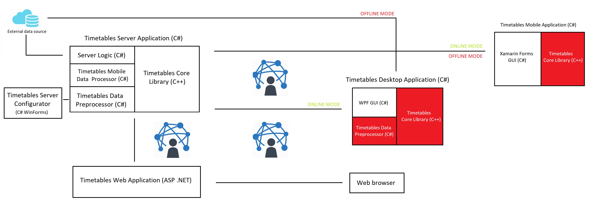

<h1>Introduction to the Problem</h1>
The goal of the project is to design and implement a set of applications for convenient search in any timetable, allowing end-users to search for timetables using a desktop, web or mobile application. A desktop application that has a user-friendly graphical interface and whose target platform is Win32 will allow offline users to search for connections within their selected timetables and get information about departures from the stops. Once you have switched to online mode, you will be able to see the current situation in operation, transport extraordinary and information on the exits. Online mode will be required for the occasional update of timetables, which the application will perform on its own at regular intervals (once every few days), or if this interval is exceeded whenever the target machine connects to the Internet. If the user does not wish to have stored timetables on their machine, there is an option to connect to the remote server where the data is stored. In this case, the desktop application will only act as a mediator between the user and the server. This way, the web application will work. Mobile apps will only vary by going offline, allowing the user to download timetables for their favorite route that will be available for a few days ahead and thus have the ability to search for offline connections. Part of this will be a product web presentation written in HTML5 and CSS3, where all the important information will be.

<h1>Available resources</h1>
Since the application is intended for Prague Integrated Transport, we are forced to use the GTFS timetable as the main data source. This format, designed by Google, is very variable. The goal is to optimize the solution for Prague, but the application will also give the user the ability to simply change the destination city - timetables in this format are also provided for other large (not only) European cities such as London, Paris or Rome. The search algorithms in the timetables are many, most of them using some modified Dijkstra algorithm. This solution will use the RAPTOR algorithm developed by Microsoft that does not need a priority queue and is fast and efficient enough. The algorithm works in bikes where the fastest bikes will find the fastest connection to all stops we can get by k-1 transfers. This means that we do not look for a connection to only one destination stop, but to all stops in the chart of the transport network. But it does not matter, because the time complexity remains very good (linear to the lines of all lines, we only go through once) and the memory consumption is also not essential for today's circumstances, as we only reconstruct the various connections by three pointers - a link to a particular line trip), a link to the boarding station on a trip, and a link to the exit station on that trip. This means that one transfer connection consumes (without overhead of all containers and classes used) only 24k bytes of memory on the x64 platform, 12k bytes of memory on the x86 platform. From a software-engineering point of view, it will be possible to simply change the GTFS format by overwriting only one part of the application that takes care of parsing in some kind of inter-format. Everything else will not need to be modified.

<h1>Architecture</h1>

<h2>Links</h2>
<a href="https://developers.google.com/transit/gtfs/reference/">GTFS Format Reference</a> 
<a href="https://www.microsoft.com/en-us/research/wp-content/uploads/2012/01/raptor_alenex.pdf">RAPTOR Algorithm</a> 
<a href="http://timetables2019.cz">Product Website</a>
